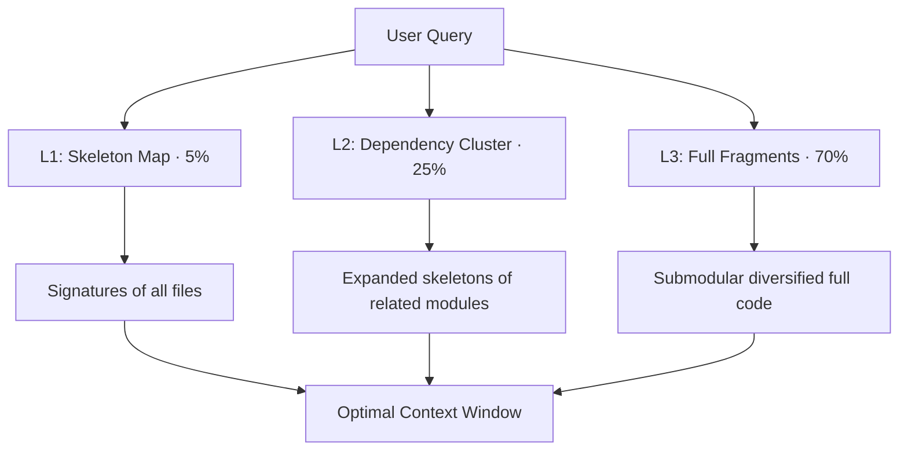

<p align="center">
  
</p>

<h1 align="center">Entroly</h1>

<p align="center">
  <b>Information-theoretic context compression for AI coding agents.</b>
</p>

<p align="center">
  
  
  
  
  
  
  
</p>

---

## Quick Start (60 seconds)

```bash
# Install
pip install entroly

# Option A: Add to your AI tool (auto-detects Cursor, VS Code, Claude Desktop)
entroly init

# Option B: Invisible proxy mode (works with ANY AI tool)
entroly proxy --quality balanced

# Check it's working
entroly status

# See live metrics dashboard
entroly dashboard
```

**Quality presets:** `--quality speed` | `fast` | `balanced` | `quality` | `max` (or any float 0.0-1.0)

**Troubleshooting:** See the [Troubleshooting](#troubleshooting) section below.

---

Every AI coding tool — Cursor, Copilot, Claude Code, Cody — manages context with dumb heuristics: stuff tokens until the window fills, then cut. Entroly uses mathematics to compress an **entire codebase** into the optimal context window, and then **learns** which types of context produce better outcomes.

##  The Problem

Current AI tools use **Cosine Similarity** (Vector Search). It's great for finding "things that look like my query," but terrible for coding because:
1. **Context Blindness**: Finds "the top 5 files" but misses the 6th file with the critical interface definition.
2. **Boilerplate Waste**: 40% of retrieved code is often imports or repetitive boilerplate.
3. **Static Heuristics**: Selection weights never improve — every session starts from zero.

##  The Solution: Entroly

Entroly replaces "dumb search" with **Information-Theoretic Compression + Online RL**. It treats the context window as a finite resource, uses principled combinatorial optimization to fill it, and learns better selection strategies from every session outcome.

---

```
pip install entroly
```

## How It's Different

**Sourcegraph Cody** does *search*: "Find 5–10 files that look relevant." **Entroly** does *compression*: "Show the LLM the **entire codebase** at variable resolution — and learn what works."

| | Cody / Copilot | Entroly |
|--|----------------|---------|
| **Approach** | Embedding similarity search | Information-theoretic compression + online RL |
| **Coverage** | 5–10 files (the rest is invisible) | 100% codebase at variable resolution |
| **Selection** | Top-K by cosine distance | KKT-optimal bisection with submodular diversity |
| **Dedup** | None | SimHash + LSH in O(1) |
| **Learning** | Static | REINFORCE with KKT-consistent baseline (first-order) |
| **Security** | None | Built-in SAST (55 rules, taint-aware) |
| **Temperature** | User-set | ADGT × PCNT self-calibrating (no tuning needed) |

## Architecture

Hybrid Rust + Python. All math runs in Rust via PyO3 (50–100× faster). MCP protocol and orchestration run in Python.

```
┌─────────────────────────────────────────────────────────┐
│  IDE (Cursor / Claude Code / Cline / Copilot)           │
│                                                         │
│  ┌──── MCP mode ────┐    ┌──── Proxy mode ────┐        │
│  │ entroly MCP server│    │ localhost:9377     │        │
│  │ (JSON-RPC stdio)  │    │ (HTTP reverse proxy)│       │
│  └────────┬──────────┘    └────────┬───────────┘        │
│           │                        │                    │
│  ┌────────▼────────────────────────▼───────────┐        │
│  │          Entroly Engine (Python)             │        │
│  │  ┌─────────────────────────────────────┐     │       │
│  │  │  entroly-core (Rust via PyO3)       │     │       │
│  │  │  15 modules · 340 KB · 113 tests    │     │       │
│  │  └─────────────────────────────────────┘     │       │
│  └──────────────────────────────────────────────┘       │
└─────────────────────────────────────────────────────────┘
```

Two deployment modes:
- **MCP Server** — IDE calls `remember_fragment`, `optimize_context`, etc. via MCP protocol
- **Prompt Compiler Proxy** — invisible HTTP proxy at `localhost:9377`, intercepts every LLM request and auto-optimizes (zero IDE changes beyond API base URL)

## Engines

### Rust Core (15 modules)

| Module | What | How |
|--------|------|-----|
| **hierarchical.rs** | 3-level codebase compression (ECC) | L1: skeleton map of ALL files · L2: dep-graph cluster expansion · L3: knapsack-optimal full fragments with submodular diversity |
| **knapsack.rs** | Optimal context subset selection | τ ≥ 0.05: exact KKT dual bisection O(30·N) · τ < 0.05: exact 0/1 DP O(N×1000) |
| **knapsack_sds.rs** | IOS: Information-Optimal Selection | Submodular Diversity Selection (SDS) + Multi-Resolution Knapsack (MRK) in one greedy pass · (1−1/e) optimality guarantee |
| **prism.rs** | Spectral weight optimizer (PRISM) | Exact Jacobi eigendecomposition of 4×4 gradient covariance · Q Λ⁻¹/² Qᵀ natural gradient · exposes condition_number() for PCNT |
| **entropy.rs** | Information density scoring | Shannon entropy (40%) + boilerplate detection (30%) + cross-fragment n-gram redundancy (30%) |
| **depgraph.rs** | Dependency graph + symbol table | Auto-linking: imports (1.0) · type refs (0.9) · function calls (0.7) · same-module (0.5) |
| **skeleton.rs** | AST-lite code skeleton extraction | Preserves signatures, class/struct/trait layouts, strips bodies → 60–80% token reduction |
| **dedup.rs** | Near-duplicate detection | 64-bit SimHash fingerprints · Hamming threshold ≤ 3 · 4-band LSH buckets |
| **lsh.rs** | Semantic recall index | 12-table multi-probe LSH · 10-bit sampling · ~3 μs over 100K fragments |
| **sast.rs** | Static Application Security Testing | 55 rules across 8 CWE categories · taint-flow analysis · severity scoring |
| **health.rs** | Codebase health analysis | Clone detection (Type-1/2/3) · dead symbol finder · god file detector · arch violation checker |
| **guardrails.rs** | Safety-critical file pinning | Criticality levels (Safety/Critical/Important/Normal) · task-aware budget multipliers |
| **query.rs** | Query analysis + refinement | Vagueness scoring · keyword extraction · intent classification |
| **fragment.rs** | Core data structure | Content, metadata, scoring dimensions, skeleton, SimHash fingerprint |
| **lib.rs** | PyO3 bridge + orchestrator | All modules exposed to Python · KKT-REINFORCE online learning · 113 tests |

### Python Layer

| Module | What |
|--------|------|
| **proxy.py** | Invisible HTTP reverse proxy (prompt compiler mode) |
| **proxy_transform.py** | Request parsing · context formatting (flat + hierarchical) · EGTC · APA |
| **proxy_config.py** | Model context windows · all feature flags · autotune overlay |
| **server.py** | MCP server with 10+ tools · pure Python fallbacks |
| **long_term_memory.py** | Cross-session memory via hippocampus-sharp-memory integration |
| **multimodal.py** | Image OCR · diagram parsing (Mermaid/PlantUML/DOT) · voice transcript extraction |
| **autotune.py** | Autonomous hyperparameter optimization (mutate → evaluate → keep/discard) |
| **auto_index.py** | File-system crawler for automatic codebase indexing |
| **adaptive_pruner.py** | Online RL-based fragment pruning |
| **checkpoint.py** | Gzipped JSON state serialization (~100 KB per checkpoint) |
| **prefetch.py** | Predictive context pre-loading via import analysis + co-access patterns |
| **provenance.py** | Hallucination risk detection via source verification + confidence scoring |

## Novel Algorithms

### Entropic Context Compression (ECC)

Three-level hierarchical codebase compression. The LLM sees **everything** at variable resolution:



Techniques:
1. **Symbol-reachability slicing** — BFS through dep graph from query-relevant symbols
2. **Submodular diversity selection** — diminishing returns per module (1−1/e guarantee)
3. **PageRank centrality** — hub files get priority in L2 expansion
4. **Entropy-gated budget allocation** — complex codebases get more L3 budget

### IOS — Information-Optimal Selection

Combines two algorithms in one greedy pass (`knapsack_sds.rs`):

**Submodular Diversity Selection (SDS):**
Standard knapsack assumes value(A ∪ B) = value(A) + value(B). Information has diminishing returns. SDS applies a SimHash-based diversity penalty to each candidate relative to what's already selected:

```
marginal_value(i, S) = base_value(i) × diversity_factor(simhash_i, {simhash_j : j ∈ S})
```
Greedy on `marginal_value / token_cost`. Guarantee: (1 − 1/e) ≈ 63% of optimal (Nemhauser-Wolsey-Fisher 1978).

**Multi-Resolution Knapsack (MRK):**
Each fragment has up to 3 representations with different value/cost tradeoffs:

| Resolution | Information | Tokens |
|---|---|---|
| Full | 100% | 100% |
| Skeleton (signatures only) | ~70% | ~20% |
| Reference (path + name) | ~15% | ~2% |

This is the Multiple Choice Knapsack Problem (MCKP). When budget is tight, IOS selects the lowest-cost representation that still fits.

### KKT-REINFORCE: Online Weight Learning

The scoring function is:
```
sᵢ = w_r·recency_i + w_f·frequency_i + w_s·semantic_i + w_e·entropy_i
```

Weights `w = [w_r, w_f, w_s, w_e]` are learned from session outcomes via a theoretically novel coupling between the forward selection and the backward policy gradient.

#### Forward Pass — Exact KKT Dual Bisection

The continuous relaxation of the 0/1 knapsack has the KKT condition:
```
p*ᵢ = σ((sᵢ − λ*·tokensᵢ) / τ)
```
where `λ*` is the Lagrange multiplier for the budget constraint, found via bisection:
```
g(λ) = Σᵢ σ((sᵢ − λ·tokensᵢ)/τ)·tokensᵢ − B = 0
dg/dλ = −1/τ · Σᵢ pᵢ(1−pᵢ)·tokensᵢ² < 0   (strictly monotone → bisection converges)
```
Fragments are then sorted by `pᵢ` (= by reduced cost `sᵢ − λ*·tokensᵢ`) and greedily filled to hard budget. Complexity: **O(30·N)**.

#### Backward Pass — REINFORCE with KKT Baseline

After observing the outcome (success/failure → reward R):
```
∂E[R]/∂w_k = Σᵢ (actionᵢ − p*ᵢ) · R · p*ᵢ(1−p*ᵢ)/τ · featureᵢ_k
```

where `p*ᵢ = σ((sᵢ − λ*·tokensᵢ)/τ)` uses the **same λ* from the forward pass**. This baseline is:
- **Per-item** (not a constant scalar) — calibrated to each fragment's budget cost
- **Derived from the KKT condition** — not a learned value function
- **Self-consistent** — forward and backward use the exact same probability

The σ′(·/τ) = p(1-p)/τ term focuses gradient mass on fragments near the selection boundary (those with p ≈ 0.5), automatically handling credit assignment.

#### PRISM: Natural Gradient Preconditioning

The gradient is preconditioned by the inverse square root of the gradient covariance:
```
Δw = α · Q Λ⁻¹/² Qᵀ · g
```
where `C = Q Λ Qᵀ` is the Jacobi eigendecomposition of the 4×4 running gradient covariance. High-variance weight dimensions are damped; stable ones are amplified. This is exact (not approximate) because d=4 is small enough for direct Jacobi iteration.

#### ADGT: Adaptive Dual Gap Temperature

Replaces the ad-hoc `τ *= 0.995` annealing with a principled information-theoretic signal.

The log-sum-exp dual of the budget constraint is:
```
D(λ*) = τ · Σᵢ log(1 + exp((sᵢ − λ*·cᵢ)/τ)) + λ*·B
```
The **duality gap** `G = D(λ*) − primal ∈ [0, τ·N·log(2)]`:
- G → 0: weights converged, hard selection → lower τ
- G → τ·N·log(2): all pᵢ = 0.5, maximum uncertainty → keep τ high

Natural temperature: `τ_nat = G / (N·log(2))`. Self-regulating — no decay constant needed.

#### PCNT: PRISM Condition-Number Temperature

The spectral condition number `κ = √(λ_max/λ_min)` of the PRISM gradient covariance encodes weight-space uncertainty:
- κ ≈ 1: well-conditioned weights, commit sharply (low τ)
- κ >> 1: ill-conditioned, some dimensions noisy, stay soft (high τ)

Final temperature: `τ = EMA(G/N · κ_norm, 0.90)`. No hyperparameters beyond τ_min/τ_max.

ADGT and PCNT are orthogonal: ADGT asks "how far is the current selection from the continuous optimum?", PCNT asks "how uncertain are the learned weights themselves?"

### EGTC v2 (Entropy-Gap Temperature Calibration)

Automatically derives the optimal LLM sampling temperature from context information-theoretic properties:
```
τ = clip(τ_base + Σ signal_weights × [vagueness, entropy_gap, sufficiency, task_type])
```

### APA (Adaptive Prompt Augmentation)

1. **Calibrated token estimation** — per-language chars/token ratios (Python: 3.0, Rust: 3.5, ...)
2. **Task-aware preamble** — conditional hints from security findings, vagueness, and task type
3. **Content deduplication** — MD5 hash-based dedup saves 10–20% in multi-turn sessions

---

## Setup

### Cursor

Add to `.cursor/mcp.json`:
```json
{
  "mcpServers": {
    "entroly": {
      "command": "entroly"
    }
  }
}
```

### Claude Code
```bash
claude mcp add entroly -- entroly
```

### Prompt Compiler Proxy (any IDE)
```bash
pip install entroly[proxy]
entroly proxy
```

Optional flags:
```bash
entroly proxy --quality 0.8       # Quality dial 0.0 (speed) → 1.0 (quality)
entroly proxy --port 9377         # Custom port
entroly proxy --force             # Force re-index codebase
```

Every LLM request is intercepted, optimized with the full pipeline (ECC + IOS + EGTC + APA + SAST), and forwarded transparently. < 10ms overhead. Auto-indexes your codebase on startup.

### Docker (cross-platform, build-once-run-everywhere)
```bash
docker pull ghcr.io/juyterman1000/entroly:latest
docker run --rm -p 9377:9377 ghcr.io/juyterman1000/entroly:latest
```
Multi-arch: `linux/amd64` and `linux/arm64` (Apple Silicon, AWS Graviton).

### Live Intelligence Dashboard

The proxy auto-launches a live dashboard at `http://localhost:9378` showing real-time metrics:

<p align="center">
  
</p>

- **Savings counter** — total cost saved, tokens saved, dedup hits
- **PRISM Intelligence radar** — RL-learned weights evolving in real-time
- **Code Health ring** — A-F grade with clone/dead-symbol/god-file detection
- **SAST Security shield** — 55-rule scanner with CWE category breakdown
- **Knapsack decisions** — per-fragment scores with inclusion/exclusion reasons
- **Request flow sparkline** — live token savings per proxy request

---

## MCP Tools

| Tool | Purpose |
|------|---------|
| `remember_fragment` | Store context with auto-dedup, entropy scoring, dep linking, criticality detection |
| `optimize_context` | Select optimal context subset for a token budget (IOS + ECC + KKT bisection) |
| `recall_relevant` | Sub-linear semantic recall via multi-probe LSH |
| `record_outcome` | Feed the KKT-REINFORCE weight learning loop |
| `explain_context` | Per-fragment scoring breakdown with sufficiency analysis |
| `checkpoint_state` | Save full session state (gzipped JSON, includes λ*, dual_gap, PRISM covariance) |
| `resume_state` | Restore from checkpoint |
| `prefetch_related` | Predict and pre-load likely-needed context |
| `get_stats` | Session statistics and cost savings |
| `health_check` | Clone detection, dead symbols, god files, arch violations |

---

## The Math

### Multi-Dimensional Fragment Scoring

```
sᵢ = w_r·recency + w_f·frequency + w_s·semantic + w_e·entropy
```

Applied via soft sigmoid: `pᵢ = σ((sᵢ − λ*·tokensᵢ) / τ)` — items are weighted both by their intrinsic score and by their token cost relative to the budget dual variable.

**Score components:**
- **Recency**: Ebbinghaus forgetting curve — `exp(−ln(2) × Δt / half_life)`
- **Frequency**: Normalized access count with spaced repetition boost
- **Semantic similarity**: SimHash Hamming distance to query, normalized to [0, 1]
- **Information density**: Shannon entropy + boilerplate ratio + cross-fragment redundancy

### Context Selection — Two Paths

**Soft path (τ ≥ 0.05):** KKT dual bisection — O(30·N):
```
Find λ* ≥ 0 s.t. Σᵢ σ((sᵢ − λ*·tokensᵢ)/τ)·tokensᵢ = B
Sort by pᵢ = σ((sᵢ − λ*·tokensᵢ)/τ), greedy fill to hard budget
```

**Hard path (τ < 0.05):** Exact 0/1 DP — O(N × 1000):
```
Maximize:   Σ sᵢ·xᵢ
Subject to: Σ tokensᵢ·xᵢ ≤ B,   xᵢ ∈ {0, 1}
```

The soft path is the default during learning. As τ → 0 (via ADGT), probabilities converge to hard 0/1 selections and the DP fallback activates automatically.

### SAST Security Categories

| Category | CWE | Rules |
|----------|-----|-------|
| Hardcoded Secrets | CWE-798 | API keys, passwords, tokens, private keys |
| SQL Injection | CWE-89 | f-strings, concatenation, raw queries (taint-aware) |
| Command Injection | CWE-78 | os.system, subprocess with shell=True |
| Path Traversal | CWE-22 | open() with user input, os.path.join |
| XSS | CWE-79 | innerHTML, template injection |
| SSRF | CWE-918 | requests with user-controlled URLs |
| Insecure Crypto | CWE-327 | MD5/SHA1 for auth, weak key sizes |
| Auth Flaws | CWE-287 | Hardcoded roles, missing auth checks |

---

## Configuration

```python
EntrolyConfig(
    default_token_budget=128_000,     # GPT-4 Turbo equivalent
    max_fragments=10_000,             # session fragment cap
    weight_recency=0.30,              # initial scoring weights (learned online)
    weight_frequency=0.25,
    weight_semantic_sim=0.25,
    weight_entropy=0.20,
    decay_half_life_turns=15,         # Ebbinghaus half-life
    enable_hierarchical_compression=True,  # 3-level ECC
    enable_ios=True,                       # IOS (SDS + MRK)
    enable_ios_diversity=True,             # submodular diversity penalty
    enable_ios_multi_resolution=True,      # skeleton/reference fallback
    enable_temperature_calibration=True,   # EGTC v2
    enable_prompt_directives=True,         # APA preamble
    enable_security_scan=True,             # SAST
)
```

---

## References

**Foundations used:**
- Shannon (1948) — Information Theory
- Charikar (2002) — SimHash
- Ebbinghaus (1885) — Forgetting Curve
- Nemhauser, Wolsey & Fisher (1978) — Submodular Maximization (1−1/e guarantee)
- Sviridenko (2004) — Submodular + Knapsack constraint
- Minoux (1978) — Lazy greedy acceleration
- Kellerer, Pferschy, Pisinger (2004) — Multiple Choice Knapsack (MCKP)
- Boyd & Vandenberghe — Convex Optimization §5.2 (KKT duality, dual bisection)
- Williams (1992) — REINFORCE policy gradient
- Dantzig (1957) — Greedy Knapsack Approximation
- Wilson (1927) — Score Confidence Intervals

**Related work (RAG / context compression):**
- LLMLingua (EMNLP 2023) — Perplexity-based Token Compression
- LongLLMLingua (ACL 2024) — Query-aware Context Compression
- RepoFormer (ICML 2024 Oral) — Selective Retrieval for Repo-Level Code
- FILM-7B (NeurIPS 2024) — Structure-First Layout
- CodeSage (ICLR 2024) — Code Embedding Representation Learning
- SWE-bench (ICLR 2024) / SWE-agent (NeurIPS 2024) — Evaluation

**Novel compositions (not in prior literature):**
- KKT-REINFORCE: the dual variable λ* of the forward budget constraint as the per-item REINFORCE baseline (forward + backward use the same probability)
- ADGT: duality gap G = D(λ*) − primal as a self-regulating temperature signal
- PCNT: PRISM spectral condition number as a weight-uncertainty-aware temperature modulator

---

## CLI Commands

| Command | Purpose |
|---------|--------|
| `entroly serve` | Start MCP server (default — used by Cursor, Claude Code) |
| `entroly proxy` | Start invisible prompt compiler proxy on :9377 |
| `entroly dashboard` | Launch value dashboard on :9378 |
| `entroly init` | Auto-detect project type and configure IDE integration |
| `entroly health` | Run code health analysis (clones, dead symbols, god files) |
| `entroly autotune` | Run autonomous hyperparameter optimization |
| `entroly benchmark` | Run competitive benchmark (Entroly vs Raw vs Top-K) |
| `entroly status` | Check if proxy/dashboard is running |
| `entroly config` | Show current configuration |
| `entroly completions` | Generate shell completion scripts (bash/zsh/fish) |

## Part of the Ebbiforge Ecosystem

Entroly integrates with [hippocampus-sharp-memory](https://pypi.org/project/hippocampus-sharp-memory/) for persistent cross-session memory and [Ebbiforge](https://pypi.org/project/ebbiforge/) for TF embeddings and RL weight learning. Both are optional.

## Troubleshooting

**Docker not running:**
```
entroly proxy  # No Docker needed — runs natively
# Or install the native Rust engine:
pip install entroly[native]
```

**Port 9377 already in use:**
```bash
entroly proxy --port 9378
# or set ENTROLY_PROXY_PORT=9378
```

**Rust wheel not available for your platform:**
```bash
ENTROLY_NO_DOCKER=1 entroly serve  # Falls back to Python engine (slower but functional)
```

**Proxy seems slow on first request:**
This is normal — the first request warms up HTTP connections and the Rust pipeline. Subsequent requests add <10ms.

**Shell completions:**
```bash
# Bash
eval "$(entroly completions bash)"
# Zsh
eval "$(entroly completions zsh)"
# Fish
entroly completions fish > ~/.config/fish/completions/entroly.fish
```

**Environment variables:**
| Variable | Default | Description |
|----------|---------|-------------|
| `ENTROLY_QUALITY` | `0.5` | Quality dial (0.0-1.0 or preset name) |
| `ENTROLY_PROXY_PORT` | `9377` | Proxy port |
| `ENTROLY_PULL_TTL` | `3600` | Docker pull cache TTL (seconds, 0=always) |
| `ENTROLY_MAX_FILES` | `5000` | Max files to auto-index |
| `ENTROLY_RATE_LIMIT` | `0` | Max requests/min (0=unlimited) |
| `ENTROLY_NO_DOCKER` | - | Skip Docker, run natively |
| `ENTROLY_MCP_TRANSPORT` | `stdio` | MCP transport (`stdio` or `sse`) |
| `ENTROLY_TEMPERATURE_CALIBRATION` | `1` | Set to `0` to disable EGTC |

## License

MIT
