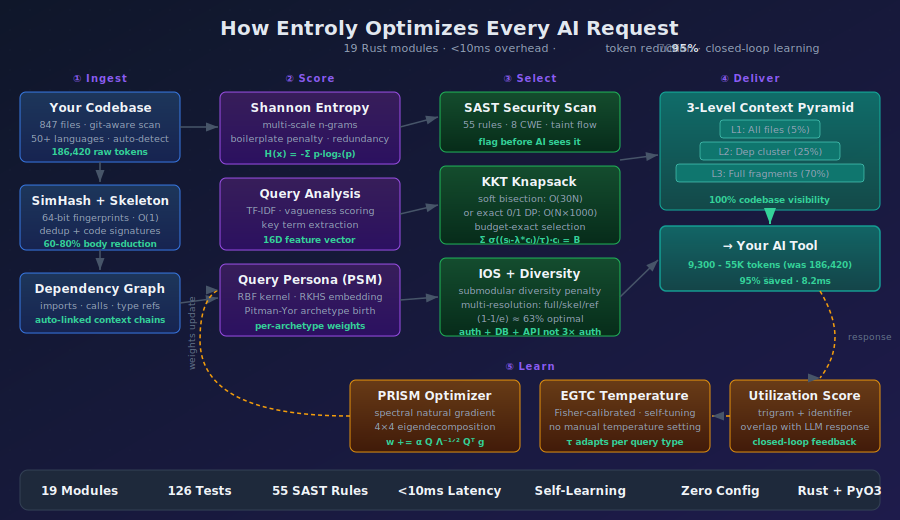

<p align="center">
  
</p>

<h1 align="center">Entroly</h1>

<h3 align="center">Stop your AI from hallucinating. Give it your entire codebase.</h3>

<p align="center">
  <b>The Context Engineering Engine for AI Coding Agents</b><br/>
  <i>Cursor, Claude Code, Copilot, Windsurf, Cline — your AI sees 5% of your code. Entroly shows it 100%.</i>
</p>

<p align="center">
  <code>pip install entroly && entroly go</code>
</p>

<p align="center">
  <a href="#the-problem">Problem</a> &bull;
  <a href="#the-fix">Solution</a> &bull;
  <a href="#30-second-install">Install</a> &bull;
  <a href="#see-it-in-action">Demo</a> &bull;
  <a href="#works-with-everything">Integrations</a> &bull;
  <a href="#how-it-works">Architecture</a> &bull;
  <a href="https://github.com/juyterman1000/entroly/discussions">Community</a>
</p>

<p align="center">
  <a href="https://pypi.org/project/entroly"></a>
  <a href="https://www.npmjs.com/package/entroly"></a>
  
  
  
  
  
</p>

---

## The Problem

Every AI coding tool — **Cursor, Claude Code, GitHub Copilot, Windsurf, Cody** — has the same fatal flaw:

> **Your AI can only see 5-10 files at a time. The other 95% of your codebase is invisible.**

This causes:
- **Hallucinated function calls** — the AI invents APIs that don't exist
- **Broken imports** — it references modules it can't see
- **Missed dependencies** — it changes `auth.py` without knowing about `auth_config.py`
- **Wasted tokens** — raw-dumping files burns your budget on boilerplate and duplicates
- **Wrong answers** — without full context, even GPT-4/Claude give incomplete solutions

You've felt this. You paste code manually. You write long system prompts. You pray it doesn't hallucinate. **There's a better way.**

---

## The Fix

**Entroly compresses your entire codebase into the context window at variable resolution.**

| What changes | Before Entroly | After Entroly |
|---|---|---|
| **Files visible to AI** | 5-10 files | **All files** (variable resolution) |
| **Tokens per request** | 186,000 (raw dump) | **~40,000** (78% reduction) |
| **Cost per 1K requests** | ~$560 | **~$124** |
| **AI answer quality** | Incomplete, hallucinated | **Correct, dependency-aware** |
| **Setup time** | Hours of prompt engineering | **30 seconds** |
| **Overhead** | N/A | **< 10ms** |

Critical files appear in full. Supporting files appear as signatures. Everything else appears as references. **Your AI sees the whole picture — and you pay 78% less.**

### How is this different from RAG?

| | RAG (vector search) | Entroly (context engineering) |
|--|---|---|
| **What it sends** | Top-K similar chunks | **Entire codebase** at optimal resolution |
| **Handles duplicates** | No — sends same code 3x | **SimHash dedup** in O(1) |
| **Dependency-aware** | No | **Yes** — auto-includes related files |
| **Learns from usage** | No | **Yes** — RL optimizes from AI response quality |
| **Needs embeddings API** | Yes (extra cost + latency) | **No** — runs locally |
| **Optimal selection** | Approximate | **Mathematically proven** (knapsack solver) |

---

## See It In Action

<p align="center">
  
</p>

```bash
pip install entroly && entroly demo    # see savings on YOUR codebase
```

> Open the [interactive demo](docs/assets/demo.html) for the animated experience.

---

## 30-Second Install

```bash
pip install entroly[full]
entroly go
```

**That's it.** `entroly go` auto-detects your IDE, configures everything, starts the proxy and dashboard. Then point your AI tool to `http://localhost:9377/v1`.

### Or step by step

```bash
pip install entroly                # core engine
entroly init                       # detect IDE + generate config
entroly proxy --quality balanced   # start proxy
```

### Node.js

```bash
npm install entroly
```

### Docker

```bash
docker pull ghcr.io/juyterman1000/entroly:latest
docker run --rm -p 9377:9377 -p 9378:9378 -v .:/workspace:ro ghcr.io/juyterman1000/entroly:latest
```

### Install options

| Package | What you get |
|---------|---|
| `pip install entroly` | Core — MCP server + Python engine |
| `pip install entroly[proxy]` | + HTTP proxy mode |
| `pip install entroly[native]` | + Rust engine (50-100x faster) |
| `pip install entroly[full]` | Everything |

---

## Works With Everything

| AI Tool | Setup | Method |
|---------|-------|--------|
| **Cursor** | `entroly init` | MCP server |
| **Claude Code** | `claude mcp add entroly -- entroly` | MCP server |
| **VS Code + Copilot** | `entroly init` | MCP server |
| **Windsurf** | `entroly init` | MCP server |
| **Cline** | `entroly init` | MCP server |
| **OpenClaw** | [See below](#openclaw-integration) | Context Engine |
| **Cody** | `entroly proxy` | HTTP proxy |
| **Any LLM API** | `entroly proxy` | HTTP proxy |

---

## Why Developers Choose Entroly

> **"I stopped manually pasting code into Claude. Entroly just works."**

- **Zero config** — `entroly go` handles everything. No YAML, no embeddings, no prompt engineering.
- **Instant results** — See the difference on your first request. No training period.
- **Privacy-first** — Everything runs locally. Your code never leaves your machine.
- **Battle-tested** — 436 tests, crash recovery, connection auto-reconnect, cross-platform file locking.
- **Built-in security** — 55 SAST rules catch hardcoded secrets, SQL injection, command injection across 8 CWE categories.
- **Codebase health grades** — Clone detection, dead code finder, god file detection. Get an A-F grade.

---

## OpenClaw Integration

[OpenClaw](https://github.com/openclaw/openclaw) users get the deepest integration — Entroly plugs in as a Context Engine:

| Agent Type | What Entroly Does | Token Savings |
|------------|---|---|
| **Main agent** | Full codebase at variable resolution | ~95% |
| **Heartbeat** | Only loads changes since last check | ~90% |
| **Subagents** | Inherited context + Nash bargaining budget split | ~92% |
| **Cron jobs** | Minimal context — relevant memories + schedule | ~93% |
| **Group chat** | Entropy-filtered messages — only high-signal kept | ~90% |

```python
from entroly.context_bridge import MultiAgentContext

ctx = MultiAgentContext(workspace_path="~/.openclaw/workspace")
ctx.ingest_workspace()
sub = ctx.spawn_subagent("main", "researcher", "find auth bugs")
```

---

## How It Works

<p align="center">
  
</p>

| Stage | What | Result |
|---|---|---|
| **1. Ingest** | Index codebase, build dependency graph, fingerprint fragments | Complete map in <2s |
| **2. Score** | Rank by information density — high-value code up, boilerplate down | Every fragment scored |
| **3. Select** | Mathematically optimal subset fitting your token budget | Proven optimal (knapsack) |
| **4. Deliver** | 3 resolution levels: full → signatures → references | 100% coverage |
| **5. Learn** | Track which context produced good AI responses | Gets smarter over time |

---

## Context Engineering, Automated

> *"The LLM is the CPU, the context window is RAM."*

| Layer | What it solves |
|---|---|
| **Documentation tools** | Give your agent up-to-date API docs |
| **Memory systems** | Remember things across conversations |
| **RAG / retrieval** | Find relevant code chunks |
| **Entroly (optimization)** | **Makes everything fit** — optimally compresses codebase + docs + memory into the token budget |

These layers are **complementary.** Entroly is the optimization layer that ensures everything fits without waste.

---

## CLI Commands

| Command | What it does |
|---------|---|
| `entroly go` | **One command** — auto-detect, init, proxy, dashboard |
| `entroly demo` | Before/after comparison with dollar savings on YOUR project |
| `entroly dashboard` | Live metrics: savings trends, health grade, PRISM weights |
| `entroly doctor` | 7 diagnostic checks — finds problems before you do |
| `entroly health` | Codebase health grade (A-F): clones, dead code, god files |
| `entroly benchmark` | Competitive benchmark: Entroly vs raw context vs top-K |
| `entroly role` | Weight presets: `frontend`, `backend`, `sre`, `data`, `fullstack` |
| `entroly autotune` | Auto-optimize engine parameters |
| `entroly digest` | Weekly summary: tokens saved, cost reduction |
| `entroly status` | Check running services |

---

## Quality Presets

```bash
entroly proxy --quality speed       # minimal optimization, lowest latency
entroly proxy --quality balanced    # recommended (default)
entroly proxy --quality max         # full pipeline, best results
entroly proxy --quality 0.7         # any float 0.0-1.0
```

---

## Platform Support

| | Linux | macOS | Windows |
|--|---|---|---|
| **Python 3.10+** | Yes | Yes | Yes |
| **Rust wheel** | Yes | Yes (Intel + Apple Silicon) | Yes |
| **Docker** | Optional | Optional | Optional |
| **Admin/WSL required** | No | No | No |

---

## Production Ready

- **Persistent savings tracking** — lifetime savings in `~/.entroly/value_tracker.json`, trend charts in dashboard
- **IDE status bar** — `/confidence` endpoint for real-time VS Code widgets
- **Rich headers** — `X-Entroly-Confidence`, `X-Entroly-Coverage-Pct`, `X-Entroly-Cost-Saved-Today`
- **Crash recovery** — gzipped checkpoints restore in <100ms
- **Large file protection** — 500 KB ceiling prevents OOM
- **Binary detection** — 40+ file types auto-skipped
- **Fragment feedback** — `POST /feedback` lets your AI rate context quality
- **Explainable** — `GET /explain` shows why each fragment was included/excluded

---

## Need Help?

```bash
entroly doctor    # runs 7 diagnostic checks
entroly --help    # all commands
```

**Email:** autobotbugfix@gmail.com — we respond within 24 hours.

<details>
<summary><b>Common Issues</b></summary>

**macOS "externally-managed-environment":**
```bash
python3 -m venv ~/.venvs/entroly && source ~/.venvs/entroly/bin/activate && pip install entroly[full]
```

**Windows pip not found:**
```powershell
python -m pip install entroly
```

**Port 9377 in use:**
```bash
entroly proxy --port 9378
```

**Rust engine not loading:** Entroly auto-falls back to Python. For Rust speed: `pip install entroly[native]`

</details>

---

## Environment Variables

| Variable | Default | What it does |
|---|---|---|
| `ENTROLY_QUALITY` | `0.5` | Quality dial (0.0-1.0 or preset) |
| `ENTROLY_PROXY_PORT` | `9377` | Proxy port |
| `ENTROLY_MAX_FILES` | `5000` | Max files to index |
| `ENTROLY_RATE_LIMIT` | `0` | Requests/min (0 = unlimited) |
| `ENTROLY_MCP_TRANSPORT` | `stdio` | MCP transport (stdio/sse) |

---

<details>
<summary><b>Technical Deep Dive — Architecture & Algorithms</b></summary>

### Architecture

Hybrid Rust + Python. All math in Rust via PyO3 (50-100x faster). MCP + orchestration in Python.

```
+-----------------------------------------------------------+
|  IDE (Cursor / Claude Code / Cline / Copilot)             |
|                                                           |
|  +---- MCP mode ----+    +---- Proxy mode ----+          |
|  | entroly MCP server|    | localhost:9377     |          |
|  | (JSON-RPC stdio)  |    | (HTTP reverse proxy)|         |
|  +--------+----------+    +--------+-----------+          |
|           |                        |                      |
|  +--------v------------------------v-----------+          |
|  |          Entroly Engine (Python)             |          |
|  |  +-------------------------------------+    |          |
|  |  |  entroly-core (Rust via PyO3)       |    |          |
|  |  |  21 modules · 380 KB · 249 tests    |    |          |
|  |  +-------------------------------------+    |          |
|  +---------------------------------------------+          |
+-----------------------------------------------------------+
```

### Rust Core (21 modules)

| Module | What | How |
|---|---|---|
| **hierarchical.rs** | 3-level codebase compression | Skeleton map + dep-graph + knapsack fragments |
| **knapsack.rs** | Context selection | KKT dual bisection O(30N) or exact DP |
| **knapsack_sds.rs** | Information-Optimal Selection | Submodular diversity + multi-resolution |
| **prism.rs** | Weight optimizer | Spectral natural gradient on 4x4 covariance |
| **entropy.rs** | Information density | Shannon entropy + boilerplate detection |
| **depgraph.rs** | Dependency graph | Auto-link imports, type refs, function calls |
| **skeleton.rs** | Code skeletons | Preserves signatures, strips bodies (60-80% reduction) |
| **dedup.rs** | Duplicate detection | 64-bit SimHash, Hamming threshold 3 |
| **lsh.rs** | Semantic recall | 12-table multi-probe LSH, ~3μs over 100K fragments |
| **sast.rs** | Security scanning | 55 rules, 8 CWE categories, taint analysis |
| **health.rs** | Codebase health | Clones, dead symbols, god files, arch violations |
| **guardrails.rs** | Safety-critical pinning | Criticality levels + task-aware budget multipliers |
| **query.rs** | Query analysis | Vagueness scoring, keyword extraction, intent |
| **query_persona.rs** | Query archetypes | RBF kernel + Pitman-Yor + per-archetype weights |
| **anomaly.rs** | Entropy anomaly detection | MAD-based robust Z-scores |
| **semantic_dedup.rs** | Semantic dedup | Greedy marginal information gain, (1-1/e) optimal |
| **utilization.rs** | Response utilization | Trigram + identifier overlap feedback |
| **nkbe.rs** | Multi-agent budgets | Arrow-Debreu KKT + Nash bargaining + REINFORCE |
| **cognitive_bus.rs** | Agent event routing | Poisson rate models, Welford spike detection |
| **fragment.rs** | Core data structure | Content, metadata, scoring, SimHash fingerprint |
| **lib.rs** | PyO3 bridge | All modules exposed to Python |

### Novel Algorithms

- **ECC** — 3-level hierarchical compression: L1 skeleton (5%), L2 deps (25%), L3 diversified fragments (70%)
- **IOS** — Submodular Diversity + Multi-Resolution Knapsack in one greedy pass, (1-1/e) optimal
- **KKT-REINFORCE** — Dual variable from budget constraint as REINFORCE baseline
- **PRISM** — Natural gradient via Jacobi eigendecomposition of 4x4 gradient covariance
- **PSM** — RBF kernel mean embedding in RKHS for query archetype discovery
- **NKBE** — Game-theoretic multi-agent token allocation via Arrow-Debreu equilibrium

### References

Shannon (1948), Charikar (2002), Nemhauser-Wolsey-Fisher (1978), Sviridenko (2004), Boyd & Vandenberghe (Convex Optimization), Williams (1992), LLMLingua (EMNLP 2023), RepoFormer (ICML 2024), FILM-7B (NeurIPS 2024), CodeSage (ICLR 2024).

</details>

---

## Part of the Ebbiforge Ecosystem

Integrates with [hippocampus-sharp-memory](https://pypi.org/project/hippocampus-sharp-memory/) for persistent cross-session memory and [Ebbiforge](https://pypi.org/project/ebbiforge/) for embeddings + RL weight learning. Both optional.

---

## License

MIT

---

<p align="center">
  <b>Your AI is blind without context. Fix it in 30 seconds.</b><br/>
  <code>pip install entroly[full] && entroly go</code>
</p>
